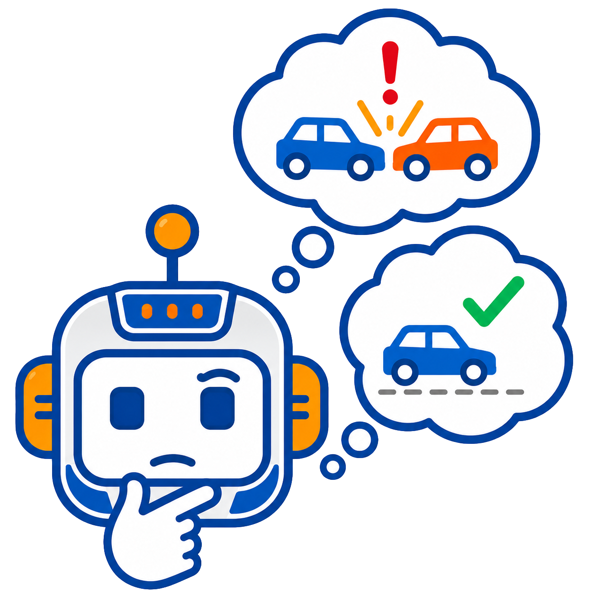
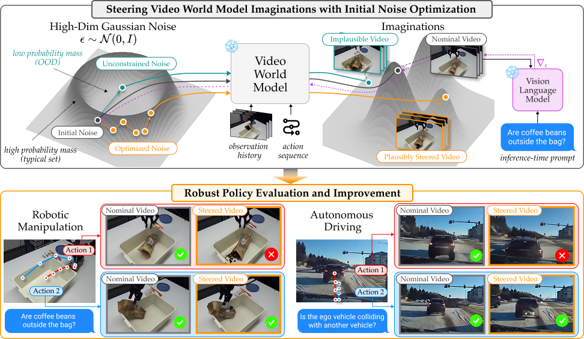

<p align="center">

</p>

<h1 align="center"><strong>StressDream</strong>: Steering Video World Models<br>for Robust Policy Evaluation and Improvement</h1>

> [Junwon Seo](https://junwon.me/), Sushant Veer, Ran Tian, Wenhao Ding, Apoorva Sharma, Karen Leung, Edward Schmerling, Marco Pavone, [Andrea Bajcsy](https://www.cs.cmu.edu/~abajcsy/)

<p align="center">
  <a href="https://stressdream.github.io/"></a>
  <a href="LICENSE"></a>
</p>

---
<div align="center">

</div>

**StressDream** is an inference-time method that optimizes diffusion noise to steer video world models toward plausible, high-impact outcomes - enabling robust evaluation and improvement of robotic policies.

---

## 📦 Modules

| Module | Domain | World Model | Reward |
|--------|--------|-------------|--------|
| [`dubins/`](dubins/README.md) | Synthetic Dubins car | Image-based 3D Dubins | Safety score (failure set) |
| [`vista/`](vista/README.md) | Driving | [Vista](https://github.com/OpenDriveLab/Vista) | X-CLIP (+ optional Qwen2.5-VL) |
| [`ctrl_world/`](ctrl_world/README.md) | Robot manipulation (DROID) | [Ctrl-World](https://github.com/Robert-gyj/Ctrl-World) | Qwen3-VL |


## 🕹️ Quick Start

```bash
# Driving (Vista)
conda env create -f vista/environment.yml
conda activate stressdream-vista
python vista/run_steering.py

# Robot manipulation (Ctrl-World)
conda env create -f ctrl_world/environment.yml
conda activate stressdream-ctrlworld
python ctrl_world/run_steering.py \
    --hdf5_path ctrl_world/example_data/traj_0001.hdf5

# Dubins car — interactive notebook
conda create -n stressdream-dubins python=3.10 && conda activate stressdream-dubins
pip install torch torchvision h5py numpy matplotlib pillow tqdm imageio wandb einops ruamel.yaml jupyter
jupyter notebook dubins/demo.ipynb

# Dubins car — CLI
python dubins/run_steering.py
```

All scripts are run from the `StressDream/` repo root. See each module's README for full details.

## 📁 Repository Layout

```
wm_steer/        # Shared components
dubins/          # Image-based Dubins-car
vista/           # Driving (Vista)
ctrl_world/      # Robot manipulation (Ctrl-World)
```

## ❤️ Acknowledgements

StressDream builds on two open-source video world models:

- **Vista** — *Vista: A Generalizable Driving World Model with High Fidelity and Versatile Controllability* ([OpenDriveLab/Vista](https://github.com/OpenDriveLab/Vista))
- **Ctrl-World** — *Ctrl-World: A Controllable Generative World Model for Robot Manipulation* ([ctrl-world.github.io](https://ctrl-world.github.io/)), built on [Stable Video Diffusion](https://github.com/Stability-AI/generative-models)

## ⭐ Citation

If StressDream helps your research, please consider citing:

```bibtex
@article{seo2026stressdream,
  title={StressDream: Steering Video World Models for Robust Policy Evaluation and Improvement},
  author={Seo, Junwon and Veer, Sushant and Tian, Ran and Ding, Wenhao and Sharma, Apoorva and Leung, Karen and Schmerling, Edward and Pavone, Marco and Bajcsy, Andrea},
  year={2026}
}
```
